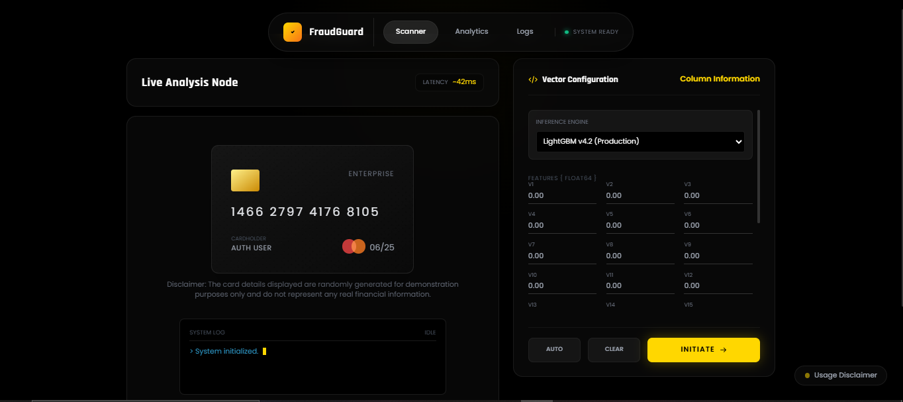

# **🚀 FraudGuard AI — Intelligent Transaction Fraud Detection System**

> **FraudGuard AI is an advanced machine learning–powered fraud detection system that combines statistical learning models with real-time inference to evaluate transaction vectors dynamically.**

> **The platform performs vectorized feature analysis, applies multiple ML models (LightGBM & Random Forest), and generates high-confidence fraud predictions in real time.**
 
> **By integrating explainable risk scoring, interactive analytics dashboards, and an enterprise-grade user interface, FraudGuard AI delivers fast, transparent, and trustworthy fraud assessments suitable for demos, applied research, and early-stage fintech security engineering.**

---

> [!TIP]
> **In a hurry?** For a high-level overview of the system architecture, tech stack, and detection pipeline, please refer to the **[Executive Summary (README.md)](./README.md)**.

---

## **Live Application**

**The operational deployment of ***FraudGuard AI Enterprise Console*** is available for direct usage.**

**Test real-time fraud inference, probability scoring, analytics dashboards, and audit logs**

[]

---

## **Dataset Source:**

```bash
https://www.kaggle.com/datasets/mlg-ulb/creditcardfraud

````

> **This project utilizes a public credit card transaction fraud dataset. Full credit goes to the original authors for making this dataset publicly available. Their contribution enabled the development and testing of this fraud detection system.**

---

## **🧩 Overview**

> **FraudGuard AI is a high-confidence fraud detection platform built on a hybrid ML architecture that combines:**

**LightGBM (Primary Production Model)**

**Random Forest (Deep Scan Model)**

**Vectorized transaction feature analysis (V1–V28 + Amount)**

**Auto-sample generation for instant testing**

**Real-time inference through a premium UI built with TailwindCSS & Chart.js**

**The system delivers fast, explainable, and privacy-aware predictions suitable for demonstrations, engineering evaluations, and early-stage fintech security integrations.**

---

## **🎯 Design Intent & Project Philosophy**

> **In applied machine learning, most fraud projects focus only on model accuracy and metrics.**

> **However, real-world systems require explainability, trust, and operational usability.**

> **The deliberate focus on a polished, enterprise-style UI was intentional.**

> **This project emphasizes system-level thinking — not just models but user experience, diagnostics, and auditability.**

## **The design choices were made to:**

> **Mirror how fraud systems operate inside banks and fintech organizations.**

> **Demonstrate product-oriented ML engineering rather than notebook-only workflows.**

> **Treat interpretability and analyst usability as first-class concerns.**

> **Elevate the project from a model demo to a complete intelligence platform.**

> **Production ML systems succeed when engineering discipline, UI clarity, and trust receive equal priority as accuracy.**

---

## **🔍 Key Features**

#### **1. ML-Based Fraud Classification**

> **The system supports multiple models:**

**LightGBM (Primary Production Engine)**
**Random Forest (Deep Scan Mode)**

> **Models evaluate normalized transaction features:**

**V1–V28 anonymized PCA features**
**Transaction amount**

---

#### **2. Smart Auto-Sample Generator**

> **Automatically populates realistic transaction values for testing**

**CSV-based sampling**
**Fallback random generator**
**One-click auto-fill**

---

#### **3. Real-Time Inference Console**

> **Live diagnostics panel with animated scan indicators**

* **Fraud / Verified visual stamp**
* **Confidence probability display**
* **Latency estimation**

---

#### **4. Interactive Analytics Dashboard**

> **Live visualization using Chart.js**

**Risk distribution (Doughnut chart)**
**Confidence trends (Line chart)**
**Fraud count center indicators**

---

#### **5. Local Audit Logging System**

> **All predictions stored securely in browser local storage**

**Timestamped records**
**Transaction value tracking**
**Verdict history**
**Database flush capability**

---

#### **6. Privacy-First Architecture**

> **No server-side logging**
> **All history stored locally on user device**

---

# **🛠 Tech Stack**

#### **Backend**

**Python 3**
**Flask**
**NumPy**
**Pandas**
**Pickle (Model loading)**
**LightGBM**
**Random Forest**

#### **Frontend**

**HTML5**
**TailwindCSS**
**Chart.js**
**JavaScript**

---

## **🛠 Models**

**lgb_model.pkl — LightGBM Production Model**
**rfc_model.pkl — Random Forest Deep Scan Model**
**Supports fallback mock inference when models unavailable**

---

## 📂 Project Structure

| File / Folder                  | Description                                                   |
|--------------------------------|---------------------------------------------------------------|
| `app.py`                       | Main backend / application entry file                         |
| `Dockerfile`                   | Docker configuration for containerizing the application       |
| `requirements.txt`             | Python dependencies list                                      |
| `Assets/`                      | Assets folder                                                  |
| └── `UI.png`                   | UI image / screenshot                                         |
| `Models/`                      | Trained models storage                                        |
| ├── `lgb_model.pkl`            | LightGBM trained model                                        |
| └── `rfc_model.pkl`            | Random Forest trained model                                   |
| `Streamlit/`                   | Streamlit application folder                                  |
| └── `app.py`                   | Streamlit app main file                                       |
| `templates/`                  | HTML templates directory                                      |
| └── `index.html`               | Main UI template                                              |
| `Credit-Card.ipynb`            | Jupyter notebook                                               |
| `README.md`                    | Project documentation                                         |
| `sample_data.csv`              | Sample dataset file                                           |
| `Technical_Deep_Dive.md`       | Technical explanation document                                |
| `LICENSE`                      | Project license file                                          |

---

## **⚙️ Installation & Setup**

> **1. Install dependencies**

```bash
pip install flask pandas numpy scikit-learn lightgbm
```

---

> **2. Run the application**

```bash
python app.py
```

---

> **3. Open in browser**

```bash
http://127.0.0.1:5000
```

---

## **🧠 Detection Pipeline**

**User inputs transaction vector**
**Feature validation**
**Model selection (LightGBM / RF)**
**ML inference**
**Probability calculation**
**Fraud threshold evaluation**
**Explainable result rendered**
**Audit log saved locally**

> **This pipeline simulates real fintech fraud screening systems.**

---

## **🔒 Security Considerations**

**Models depend on dataset quality**
**Not connected to real banking systems**
**No live transaction scanning**
**Designed for learning & prototyping**
**Client-side audit storage only**

--

## **🌐 Dataset Sources**

> **System trained using:**

**Public credit card fraud datasets**
**Synthetic transaction samples**
**Engineered feature vectors**

---

## **🤝 Acknowledgments**

**This project blends ML engineering, fintech security logic, and enterprise UI design.**
**GPT was used only for content structuring and keyword expansion.**

---

## **Output**



---

# **🏁 Conclusion**

> **FraudGuard AI delivers a modern, intelligent, multi-model fraud detection system with real-world UI, analytics, and auditability. It is suitable for portfolios, demos, teaching, and fintech security engineering practice.**

---

## **Source Availability**

> **The core implementation is maintained in a private repository.**
> **Source code can be shared upon request for evaluation.**

---

## 📜 License

This project is open-source and licensed under the [Apache License 2.0](../LICENSE).
See LICENSE file for full details.

---

## **👤 Author: Nayan Darokar**

#### **Aspiring Data Scientist — Intelligent Interfaces & ML Systems Engineering**

---

> **Connect With Me Here:**


[](https://www.linkedin.com/in/nayan-darokar-468a85294/) 
[](mailto:reachout.nayan@gmail.com)
[](https://nayan-data-scientist-v2.vercel.app/)


